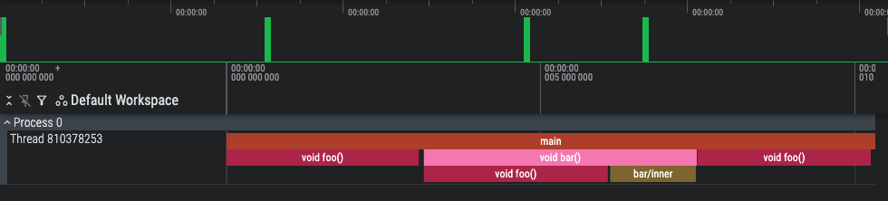

[![Contributors][contributors-shield]][contributors-url]
[![Forks][forks-shield]][forks-url]
[![Stargazers][stars-shield]][stars-url]
[![Issues][issues-shield]][issues-url]
[![MIT License][license-shield]][license-url]
[![LinkedIn][linkedin-shield]][linkedin-url]

# ⚡ CPP Stack Tracer

A lightweight, header-only instrumentation profiler for C++ that records scoped timing data using RAII and exports results in Chrome Trace JSON format, viewable with [Perfetto](https://ui.perfetto.dev/).



## 🧑‍💻 Tech Stack

![C++] ![CMake]

## ⚙️ Prerequisites and Initial Setup

- Install a `C++20` compatible compiler (GCC 10+, Clang 10+, MSVC 2019+).
- Install `CMake` version 3.20 or higher.
- Install `vcpkg` for dependency management:

```bash
cd ~
git clone https://github.com/microsoft/vcpkg.git
cd vcpkg
./bootstrap-vcpkg.sh
```

- Add `vcpkg` to your shell configuration (e.g., `.zshrc` or `.bashrc`):

```bash
export VCPKG_ROOT="<path_to_where_you_cloned_the_repo>/vcpkg"
export PATH="$VCPKG_ROOT:$PATH"
```

- Configure the project with `make`:
```bash
make configure
```

## 💻 Running the Application for MacOS

Build the application using:
```bash
make build
# OR make build BUILD_TYPE=Release
```

Build and run the application using:
```bash
make run
# OR make run BUILD_TYPE=Release
```

Test the application using:
```bash
make test
# OR make test BUILD_TYPE=Release
```

## 🧰 Basic Usage

1. Include the `instrumentor_macros.h` header in your source files:

```cpp
#include "instrumentor_macros.h"
```

2. Start and end a profiling session using the provided macros:
(⚠️ Always call `ST_PROFILE_END_SESSION()` to ensure valid JSON output.)

```cpp
int main() {
    ST_PROFILE_BEGIN_SESSION("Example Session", "results.json");

    // your code here

    ST_PROFILE_END_SESSION();

    return 0;
}
```

3. To instrument specific scopes or functions, use the following macros:

```cpp
void foo() {
    ST_PROFILE_FUNCTION();

    // work
}

// OR for inner scopes
void bar() {
    ST_PROFILE_FUNCTION();

    {
        ST_PROFILE_SCOPE("bar/inner");
        // work
    }
}
```

4. Run the application using `make run` and view the generated `results.json` file in [Perfetto](https://ui.perfetto.dev/) or Chrome Trace.

5. To open a trace file in Perfetto, go to [Perfetto UI](https://ui.perfetto.dev/), click on "Open trace file", and select the `results.json` file generated by your application.

## 🧑‍🤝‍🧑 Developers

| Name           | Email                      |
| -------------- | -------------------------- |
| Tom Aston      | mailto:mail@tomaston.dev     |


<!-- MARKDOWN LINKS & IMAGES -->
<!-- https://www.markdownguide.org/basic-syntax/#reference-style-links -->
[contributors-shield]: https://img.shields.io/github/contributors/TomAston1996/cpp-stack-tracer.svg?style=for-the-badge
[contributors-url]: https://github.com/TomAston1996/cpp-stack-tracer/graphs/contributors
[forks-shield]: https://img.shields.io/github/forks/TomAston1996/cpp-stack-tracer.svg?style=for-the-badge
[forks-url]: https://github.com/TomAston1996/cpp-stack-tracer/network/members
[stars-shield]: https://img.shields.io/github/stars/TomAston1996/cpp-stack-tracer.svg?style=for-the-badge
[stars-url]: https://github.com/TomAston1996/cpp-stack-tracer/stargazers
[issues-shield]: https://img.shields.io/github/issues/TomAston1996/cpp-stack-tracer.svg?style=for-the-badge
[issues-url]: https://github.com/TomAston1996/cpp-stack-tracer/issues
[license-shield]: https://img.shields.io/github/license/TomAston1996/cpp-stack-tracer.svg?style=for-the-badge
[license-url]: https://github.com/TomAston1996/cpp-stack-tracer/blob/master/LICENSE.txt
[linkedin-shield]: https://img.shields.io/badge/-LinkedIn-black.svg?style=for-the-badge&logo=linkedin&colorB=555
[linkedin-url]: https://linkedin.com/in/tomaston96
[React.js]: https://img.shields.io/badge/React-20232A?style=for-the-badge&logo=react&logoColor=61DAFB
[React-url]: https://reactjs.org/
[TypeScript]: https://img.shields.io/badge/typescript-%23007ACC.svg?style=for-the-badge&logo=typescript&logoColor=white
[Redux]: https://img.shields.io/badge/redux-%23593d88.svg?style=for-the-badge&logo=redux&logoColor=white
[Chart.js]: https://img.shields.io/badge/chart.js-F5788D.svg?style=for-the-badge&logo=chart.js&logoColor=white
[Bootstrap]: https://img.shields.io/badge/bootstrap-%238511FA.svg?style=for-the-badge&logo=bootstrap&logoColor=white
[NodeJS]: https://img.shields.io/badge/node.js-6DA55F?style=for-the-badge&logo=node.js&logoColor=white
[Python]: https://img.shields.io/badge/python-3670A0?style=for-the-badge&logo=python&logoColor=ffdd54
[Pandas]: https://img.shields.io/badge/pandas-%23150458.svg?style=for-the-badge&logo=pandas&logoColor=white
[C++]: https://img.shields.io/badge/c++-%2300599C.svg?style=for-the-badge&logo=c%2B%2B&logoColor=white
[OpenCV]: https://img.shields.io/badge/opencv-%23white.svg?style=for-the-badge&logo=opencv&logoColor=white
[CMake]: https://img.shields.io/badge/CMake-%23008FBA.svg?style=for-the-badge&logo=cmake&logoColor=white